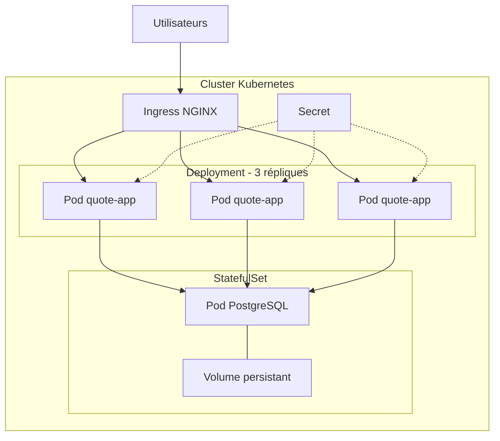
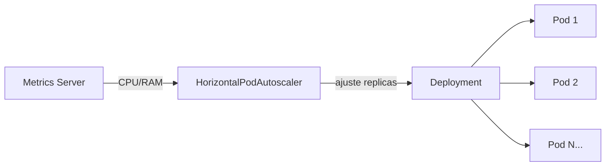

# RES507 – Final Systems Challenge

## Section 1 : Problèmes du système actuel

### Problème 1 – Pod unique

**Problème :** Le Deployment tourne avec un seul pod. Si ce pod plante, l'application est indisponible le temps que Kubernetes en recrée un.

**Risque :** Tout crash ou mise à jour provoque un downtime visible par les utilisateurs.

---

### Problème 2 – Base de données et API dans le même container

**Problème :** PostgreSQL et l'API tournent dans le même container. Un container est conçu pour un seul processus. De plus, sans `PersistentVolumeClaim`, le stockage est éphémère : les données sont perdues à chaque redémarrage. Si on scale le pod, chaque réplique a sa propre base de données, rendant les données incohérentes.

**Risque :** L'API ne peut pas scaler, et les données sont perdues à chaque crash.

---

### Problème 3 – Secrets en clair

**Problème :** Les credentials de la base de données sont écrits en clair dans le manifeste YAML. Ils sont lisibles par quiconque a accès au dépôt Git ou au cluster.

**Risque :** Exposition totale des credentials en cas de fuite du dépôt.

---

### Problème 4 – Absence de probes

**Problème :** Sans `readinessProbe` ni `livenessProbe`, Kubernetes considère un pod comme sain dès qu'il démarre, peu importe son état réel.

**Risque :** Du trafic est routé vers des pods non fonctionnels, et un pod planté ne sera jamais redémarré automatiquement.

---

### Problème 5 – Absence de resource limits

**Problème :** Sans `requests` ni `limits`, un pod peut consommer toutes les ressources du nœud et Kubernetes ne peut pas planifier les pods intelligemment.

**Risque :** Un pic de charge ou une fuite mémoire peut faire tomber tous les pods du nœud.

---

## Section 2 : Architecture de production cible

### Diagramme d'architecture

### Spécifications des ressources Kubernetes

| Ressource | Kind | Description |
|---|---|---|
| `quote-app` | `Deployment` | 3 replicas, stratégie RollingUpdate |
| `quote-app` | `Service` (ClusterIP) | Routage interne vers les pods |
| `quote-app` | `Ingress` | Exposition externe HTTP |
| `postgres` | `StatefulSet` | 1 replica stable avec identité réseau fixe |
| `postgres` | `Service` (ClusterIP) | Accès stable à la BDD |
| `postgres-pvc` | `PersistentVolumeClaim` | Stockage durable pour PostgreSQL |
| `quote-db-secret` | `Secret` | Credentials BDD chiffrés |

---

## Section 3 : Stratégie opérationnelle

### 1. Scalabilité – Comment le système gère-t-il l'augmentation du trafic ?

Le `Deployment` tourne avec **3 replicas** et le `Service` répartit le trafic entre les pods. En cas de pic, on peut augmenter le nombre de replicas manuellement (`kubectl scale`) ou automatiquement via un **HorizontalPodAutoscaler (HPA)** qui ajuste le nombre de pods en fonction de la charge CPU/mémoire.

### 2. Mises à jour sûres – Quelle stratégie de rollout est utilisée ?

On utilise une stratégie **RollingUpdate** : les nouveaux pods remplacent les anciens un par un. Aucun pod n'est supprimé avant que le suivant soit prêt (vérifié par la `readinessProbe`). En cas de problème, `kubectl rollout undo` revient immédiatement à la version précédente.

---

## Section 4 : Point de défaillance le plus critique

### Le maillon le plus faible : PostgreSQL (instance unique)

Malgré 3 replicas côté applicatif, **PostgreSQL reste un Single Point of Failure (SPOF)**.

1. **Instance unique** : Si le pod PostgreSQL crashe, la base est indisponible jusqu'au redémarrage. Toute l'application tombe avec elle.

2. **Goulot de connexions** : Les pods applicatifs (et le HPA) ouvrent chacun plusieurs connexions vers PostgreSQL. Sans pool de connexions, PostgreSQL atteint rapidement sa limite et rejette les requêtes.

3. **Performances I/O** : Le débit est limité par le `PersistentVolume` sous-jacent, partagé avec le reste du nœud.

**Solution à envisager :** Déployer un cluster PostgreSQL haute disponibilité avec réplication (ex: **CloudNativePG** ou **Patroni**) avec un replica en lecture pour distribuer les requêtes SELECT.

---

